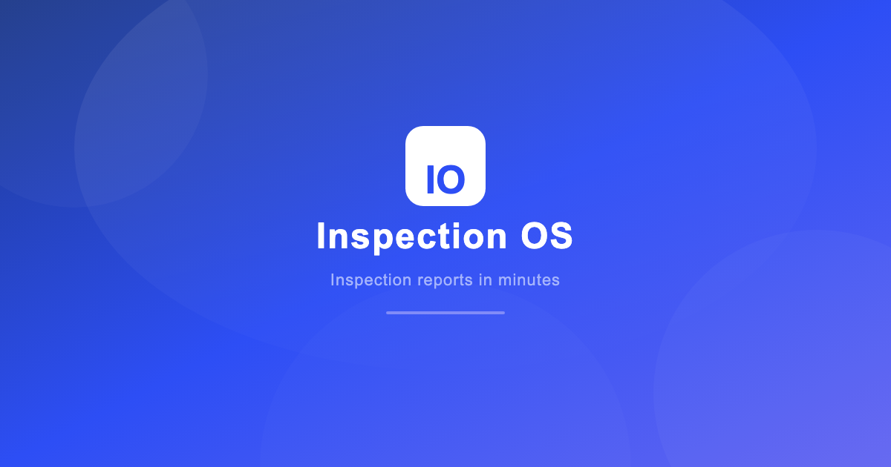
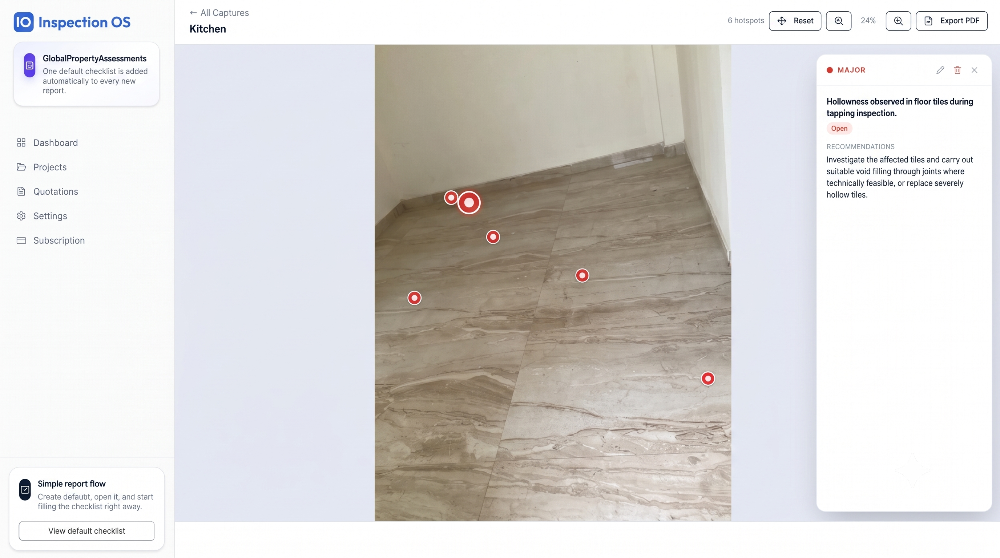
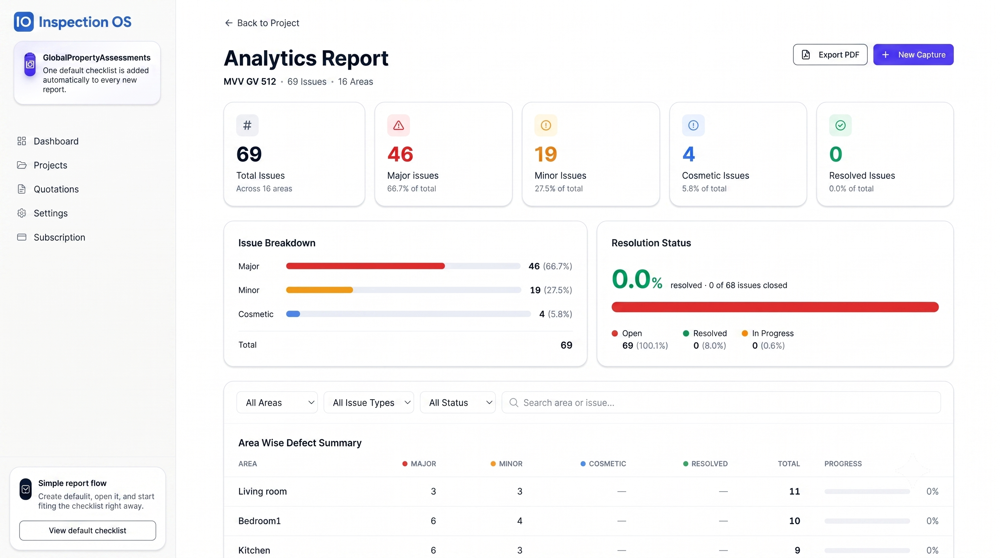
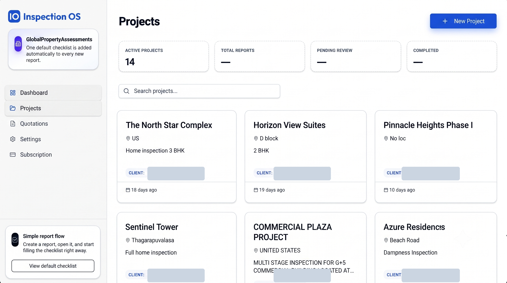
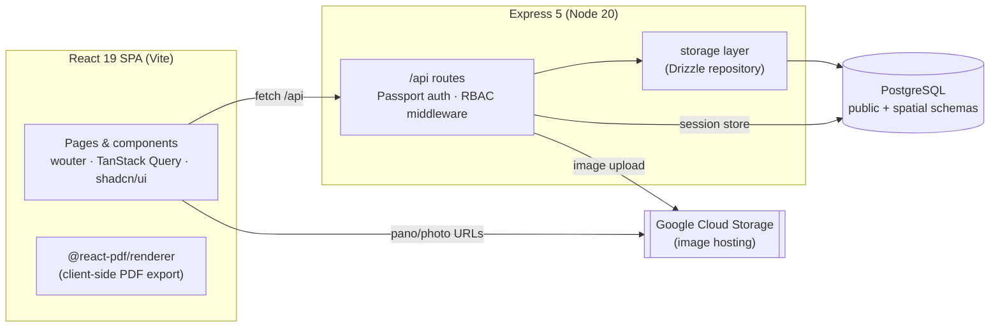
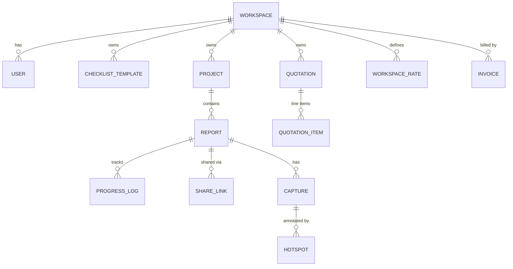

<div align="center">
  

  # Inspection OS

  **Inspection reports in minutes, not days.**

  A multi-tenant SaaS for property &amp; building inspection teams — run checklists,
  capture site photos (including 360° panoramas with defect hotspots pinned right on
  the image), track issues by severity, generate client-ready PDF reports and
  quotations, and share a read-only client portal.

  <sub>TypeScript · React 19 · Express 5 · PostgreSQL · Drizzle ORM</sub>
</div>

---

## Why it exists

Inspection firms typically spend **days** turning on-site findings into a professional
report — juggling photos, spreadsheets, and Word templates. Inspection OS collapses that
workflow into a single tool: **checklist → capture → mark severity → export → share**,
taking a typical inspection report from *3 days to ~3 hours*.

## Features

- **Multi-tenant workspaces** — each company is an isolated tenant with its own data,
  team, and branding. Role-based access control (`super_admin`, `admin`, `inspector`, `viewer`).
- **Smart checklists** — reusable, per-workspace checklist templates with severity marking
  and photo attachments; a default checklist is seeded into every new report.
- **360° captures + visual hotspot mapping** — upload site photos and panoramas, then pin
  defects as hotspots directly on the image, each with severity and resolution status.
- **Report editor &amp; preview** — build reports with inspection data, dimensions, and issues;
  Draft / Review / Final statuses.
- **Issue tracking** — severity + status per defect, with before/after "resolved" photos.
- **Quotations &amp; invoices** — line-item client quotes with rates and tax, exported to PDF.
- **Client share portal** — a tokenized, expiring, read-only link so clients view reports
  without an account.
- **Client-side PDF generation** — reports, quotations, and receipts rendered in-browser
  with [`@react-pdf/renderer`](https://react-pdf.org/).

## Screenshots

<p align="center">
  
</p>

| 360° hotspot mapping | Defect analytics | Projects dashboard |
|---|---|---|
|  |  |  |


## Architecture

A single-deployable monolith: Express serves both the JSON API and the built React SPA,
sharing one typed schema across client and server.



**Shared types.** `shared/schema.ts` defines Drizzle tables, Zod validators, and the
TypeScript types consumed by *both* client and server — so the API contract can't silently
drift. Path aliases: `@/*` → `client/src`, `@shared/*` → `shared`.

## Data model

Multi-tenant, keyed on `workspaceId` with cascade deletes. 360° captures and their hotspots
live in a dedicated `spatial` Postgres schema.



## Tech stack

| Layer | Choices |
|---|---|
| **Frontend** | React 19, Vite 7, wouter, TanStack Query v5, shadcn/ui + Radix, Tailwind CSS v4, framer-motion, `@react-pdf/renderer` |
| **Backend** | Express 5, Passport (local), `express-session` + `connect-pg-simple`, bcrypt |
| **Data** | PostgreSQL, Drizzle ORM + drizzle-zod, `pg` |
| **Storage** | Google Cloud Storage (image uploads) |
| **Tooling** | TypeScript 5.6, tsx, esbuild, drizzle-kit, Docker |

## Getting started

**Prerequisites:** Node 20+, PostgreSQL 16+ (or use the bundled `docker-compose.yml`).

```bash
# 1. Install
npm install

# 2. Configure — copy the template and fill in values
cp .env.example .env
#   required: DATABASE_URL, SESSION_SECRET
#   optional: GCP_PROJECT_ID, GCP_BUCKET_NAME, GCP_CREDENTIALS

# 3. Sync the database schema
npm run db:push

# 4. Run (Express + Vite middleware on one port, default 5002)
npm run dev
```

> **Note:** `SESSION_SECRET` is **required in production** — the server refuses to start
> without it. In development an insecure placeholder is used automatically.

### Scripts

| Command | Description |
|---|---|
| `npm run dev` | Dev server (Express + Vite middleware) |
| `npm run build` | Build client (Vite) + bundle server (esbuild) → `dist/` |
| `npm start` | Run the production build |
| `npm run check` | TypeScript type-check |
| `npm run db:push` | Push Drizzle schema to the database |

### With Docker

```bash
docker compose up
```

Brings up PostgreSQL 16 + the app, wired via `DATABASE_URL`.

## Project structure

```
client/     React SPA — pages, components (PDF renderers, PanoViewer), lib
server/      Express — routes.ts (API + auth), storage.ts (Drizzle), gcp-storage.ts
shared/      schema.ts (Drizzle tables + Zod + types) shared by client & server
migrations/  Drizzle SQL migrations
script/      build (esbuild + vite), asset upload
```

## Roadmap

- **Offline-first support** — an IndexedDB-backed local store with background sync and
  conflict resolution, so inspectors can work on-site without connectivity. See
  [`OFFLINE_ROADMAP.md`](OFFLINE_ROADMAP.md).
- White-label PDF branding (per-workspace logo &amp; colors).
- PPTX export alongside PDF.

## License

All rights reserved. This repository is public for portfolio and reference purposes;
it is not licensed for reuse or redistribution.
