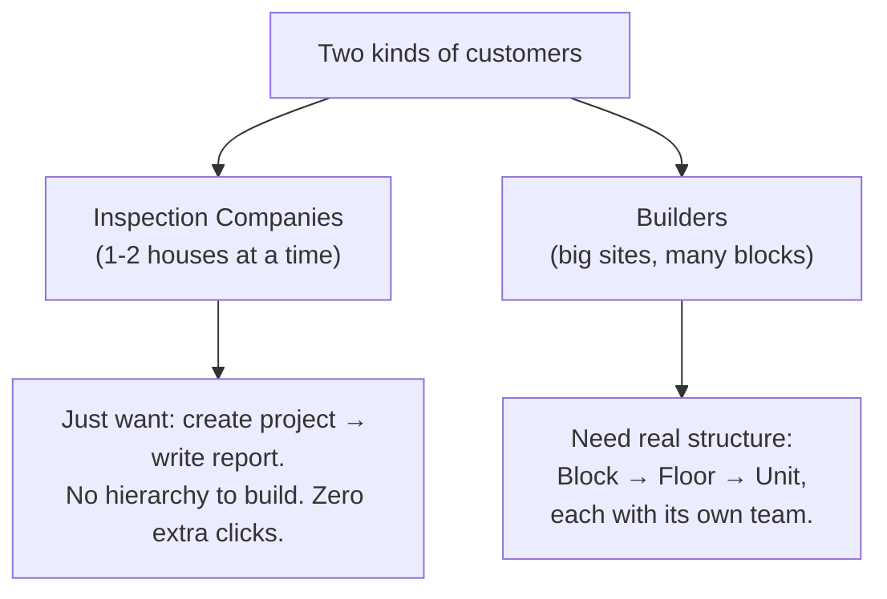
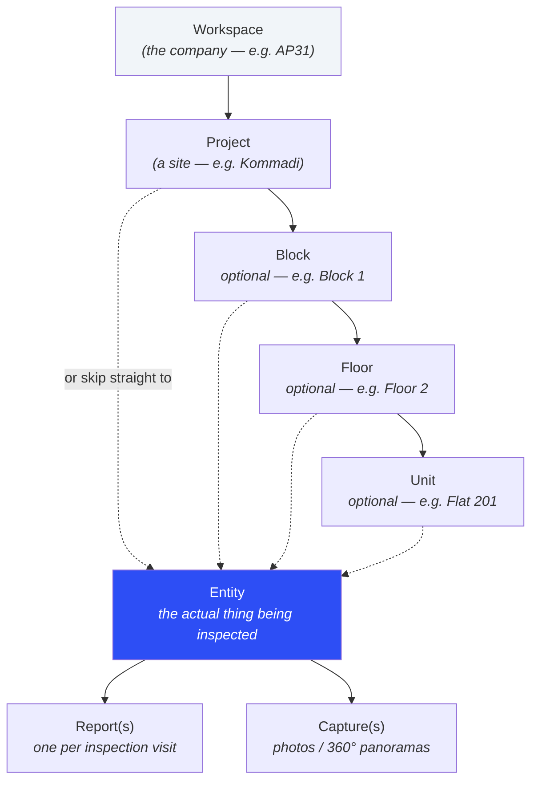
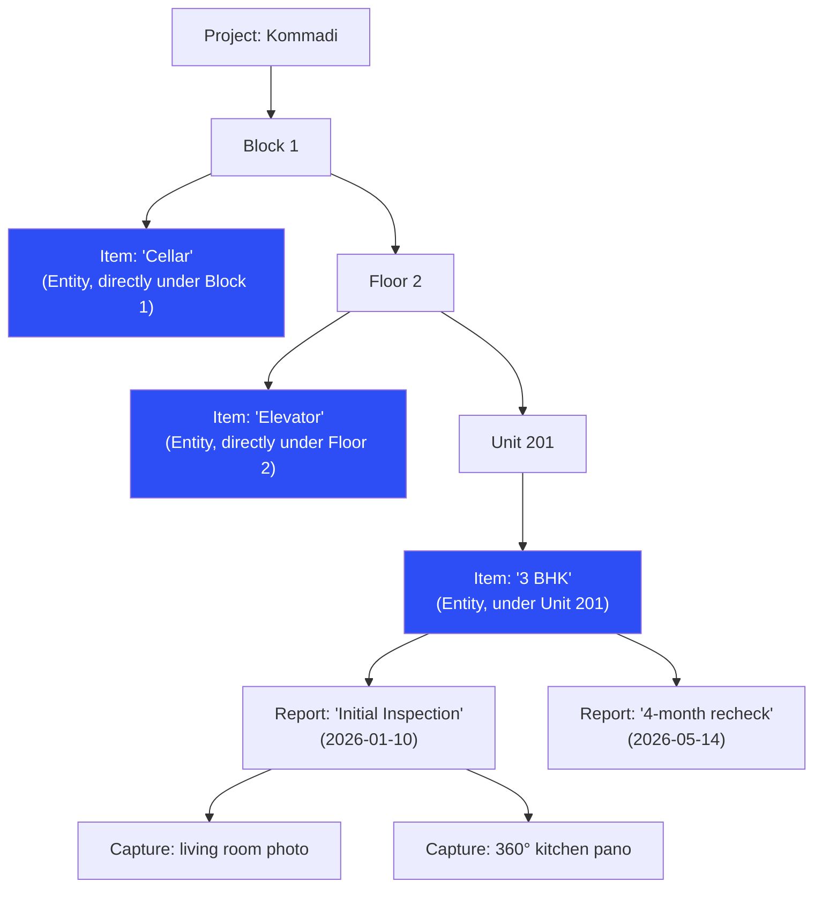
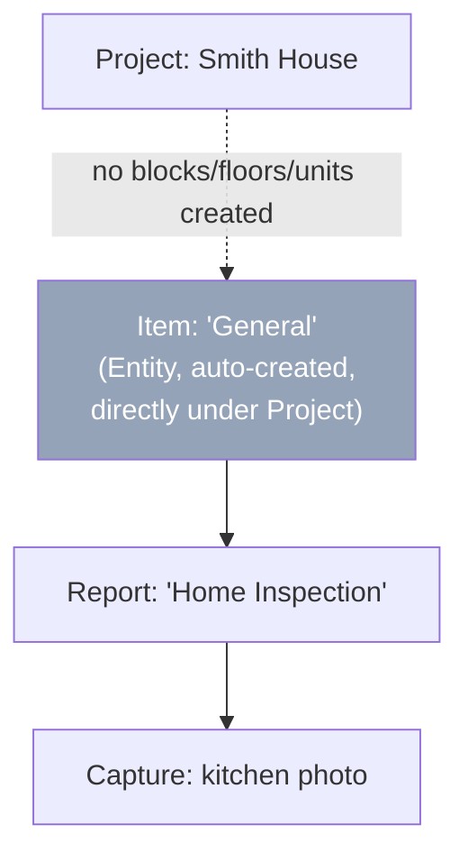
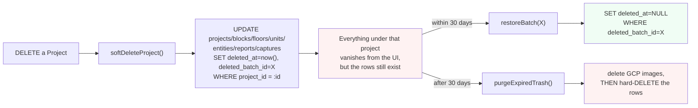

# FLOW — Building the Hierarchy & Access feature, step by step

> **Who this is for:** a junior engineer picking up this ticket. Read `docs/PLAN.md`
> first for *why* (the design decisions). This doc is *how* — in order, with
> checkpoints so you can verify each phase before moving to the next.
>
> **Golden rule for this whole feature: never run anything against the real
> Railway database while building this.** Set up a local Postgres database
> (Phase 0) and point your `.env` at *that*. Your real `.env` almost certainly
> points at Railway (`@maglev.proxy.rlwy.net` or similar) — double-check before
> running any command that touches the database.

---

## 0. The mental model (read this before writing code)

### 0.1 Who uses this, and why the hierarchy is flexible

Two kinds of customers use Inspection OS, and they need *very different* amounts
of structure:



So the schema has to support **both** a flat, simple case and a deep, structured
case — without forcing the simple case to look complicated. That's the whole
reason the design below exists.

### 0.2 The full hierarchy



**The one idea to really understand: `Entity`.**

A Block/Floor/Unit is *where something is*. An `Entity` is the actual, nameable
**thing that gets inspected** — and it can sit directly under a Block, a Floor,
a Unit, **or even directly under the Project** if there's no hierarchy at all.
Reports and captures always attach to an Entity — never straight to a
Block/Floor/Unit. That's what keeps the "attach point" logic in exactly **one**
place in the code instead of being copy-pasted onto both `reports` and
`captures`.

> 🚫 **"Entity" is a backend/database word only.** In the UI we call it an
> **"Item"** — see §0.5. Junior engineers: keep this word out of anything a
> user reads (buttons, labels, toasts). It's fine in code/schema/API.

### 0.3 Worked example — Builder (deep hierarchy)



Notice: **"Cellar" and "Elevator" are NOT nested five levels deep** — they hang
directly off Block 1 and Floor 2. Only "3 BHK" happens to sit under a Unit.
Same table (`entities`), three different parents. That's the polymorphism.

### 0.4 Worked example — Inspection Company (flat, simple)



The user never sees "Entity", never clicks "add hierarchy" — the app silently
creates one `General` Item under the project the first time they save a
report. **This is the single most important UX decision in this feature: the
simple case must stay exactly as simple as it is today.**

### 0.5 UI word choices (don't skip this — it's the #1 way this feature gets confusing)

| Database / API word | What the USER sees in the UI |
|---|---|
| `Entity` / `entities` | **"Item"** (e.g. "+ Add Item", "Items in this Unit") |
| `Block` | "Block" (already a familiar construction term) |
| `Floor` | "Floor" |
| `Unit` | "Unit" |
| `ProjectMember` | "Team member" |
| soft-delete / `deletedAt` | "Move to Trash" / "Trash" (never say "soft delete" in UI copy) |

Never expose `Entity`, `deletedBatchId`, `parent node`, or any other backend
term in a button label, toast message, or empty-state string. If you're
writing user-facing text and you're not sure what to call something, default
to the plainest possible English word.

---

## Phase 0 — Local dev environment (do this ONCE, before touching code)

You need a local Postgres database so you're never one typo away from running
a migration against the real Railway data.

1. Install Postgres locally (macOS, via Homebrew):
   ```bash
   brew install postgresql@16
   brew services start postgresql@16
   ```
2. Create a local database just for this project:
   ```bash
   createdb inspection_os_dev
   ```
3. **Do not edit your real `.env`.** Instead, pass the local database URL
   explicitly on the command line every time you run a schema command. This
   guarantees you can never accidentally hit Railway by forgetting to switch
   a file back:
   ```bash
   export LOCAL_DB="postgresql://$(whoami)@localhost:5432/inspection_os_dev"
   ```
   (Put that `export` line in your shell profile so you don't retype it.)
4. Install dependencies and generate a Prisma-free sanity check:
   ```bash
   npm install
   ```
5. **Checkpoint:** confirm you're pointed at the local DB, not Railway:
   ```bash
   echo $LOCAL_DB
   # should print postgresql://<you>@localhost:5432/inspection_os_dev
   # NOT anything with "rlwy.net" in it
   ```

You'll use `$LOCAL_DB` in every command below. If a command doesn't have
`DATABASE_URL=$LOCAL_DB` in front of it, **stop and add it** before running.

---

## Phase 1 — Schema (`shared/schema.ts`)

This is the foundation. Get this right and everything else is mechanical.

### 1.1 New imports

At the top of `shared/schema.ts`, add three more named imports from
`drizzle-orm/pg-core`:

```ts
import {
  pgTable,
  pgSchema,
  text,
  varchar,
  boolean,
  timestamp,
  jsonb,
  integer,
  numeric,
  check,        // ← new: for the "at most one parent" constraint
  uniqueIndex,  // ← new: for the partial-unique on project members
  index,        // ← new: for foreign-key lookup indexes
} from "drizzle-orm/pg-core";
```

### 1.2 Add soft-delete columns to `projects`

Find the `projects` table and add two columns right before `createdAt`:

```ts
export const projects = pgTable("projects", {
  // ...existing columns unchanged...
  isPinned: boolean("is_pinned").notNull().default(false),
  deletedAt: timestamp("deleted_at"),          // ← new
  deletedBatchId: varchar("deleted_batch_id"), // ← new
  createdAt: timestamp("created_at").defaultNow().notNull(),
});
```

Update `insertProjectSchema` to omit them, same pattern as `id`/`createdAt`:

```ts
export const insertProjectSchema = createInsertSchema(projects).omit({
  id: true,
  createdAt: true,
  deletedAt: true,       // ← new
  deletedBatchId: true,  // ← new
});
```

**Why:** `deletedAt` is when this row (and everything under it) was
soft-deleted. `deletedBatchId` groups everything deleted *in the same action*
so Restore brings back exactly what went down together — see §0 of
`docs/PLAN.md` §6 for the full reasoning.

### 1.3 Add the new tables — paste this whole block right after `projects` and before `// ─── Reports ───`

```ts
// ─── Project Members (per-project team access) ───────────────────────────────
// A user must be a member of a project to see it (workspace admins / super_admin
// bypass this and see everything). This role is scoped to ONE project —
// separate from the workspace-wide `users.role`.
export const projectMembers = pgTable(
  "project_members",
  {
    id: varchar("id").primaryKey().default(sql`gen_random_uuid()`),
    workspaceId: varchar("workspace_id")
      .notNull()
      .references(() => workspaces.id, { onDelete: "cascade" }),
    projectId: varchar("project_id")
      .notNull()
      .references(() => projects.id, { onDelete: "cascade" }),
    userId: varchar("user_id")
      .notNull()
      .references(() => users.id, { onDelete: "cascade" }),
    role: text("role", { enum: ["owner", "admin", "member", "viewer"] })
      .notNull()
      .default("member"),
    deletedAt: timestamp("deleted_at"),
    createdAt: timestamp("created_at").defaultNow().notNull(),
  },
  (table) => [
    // A user can be removed and re-added later, but never active twice at once.
    uniqueIndex("project_members_active_unique")
      .on(table.projectId, table.userId)
      .where(sql`${table.deletedAt} IS NULL`),
    index("project_members_user_idx").on(table.userId),
  ],
);

export const insertProjectMemberSchema = createInsertSchema(projectMembers).omit({
  id: true,
  createdAt: true,
  deletedAt: true,
});
export type InsertProjectMember = z.infer<typeof insertProjectMemberSchema>;
export type ProjectMember = typeof projectMembers.$inferSelect;

// ─── Site Hierarchy: Block → Floor → Unit ────────────────────────────────────
// A builder's site broken into real structure. Every level is OPTIONAL — a
// small inspection company never creates any of these and works directly on
// the Project. `projectId` is copied onto every level below (not just the
// direct parent) so access checks never have to join up the tree.
export const blocks = pgTable("blocks", {
  id: varchar("id").primaryKey().default(sql`gen_random_uuid()`),
  workspaceId: varchar("workspace_id")
    .notNull()
    .references(() => workspaces.id, { onDelete: "cascade" }),
  projectId: varchar("project_id")
    .notNull()
    .references(() => projects.id, { onDelete: "cascade" }),
  title: text("title").notNull(),
  deletedAt: timestamp("deleted_at"),
  deletedBatchId: varchar("deleted_batch_id"),
  createdAt: timestamp("created_at").defaultNow().notNull(),
});
export const insertBlockSchema = createInsertSchema(blocks).omit({
  id: true, createdAt: true, deletedAt: true, deletedBatchId: true,
});
export type InsertBlock = z.infer<typeof insertBlockSchema>;
export type Block = typeof blocks.$inferSelect;

export const floors = pgTable("floors", {
  id: varchar("id").primaryKey().default(sql`gen_random_uuid()`),
  workspaceId: varchar("workspace_id")
    .notNull()
    .references(() => workspaces.id, { onDelete: "cascade" }),
  projectId: varchar("project_id") // denormalized copy, see note above
    .notNull()
    .references(() => projects.id, { onDelete: "cascade" }),
  blockId: varchar("block_id")
    .notNull()
    .references(() => blocks.id, { onDelete: "cascade" }),
  title: text("title").notNull(),
  deletedAt: timestamp("deleted_at"),
  deletedBatchId: varchar("deleted_batch_id"),
  createdAt: timestamp("created_at").defaultNow().notNull(),
});
export const insertFloorSchema = createInsertSchema(floors).omit({
  id: true, createdAt: true, deletedAt: true, deletedBatchId: true,
});
export type InsertFloor = z.infer<typeof insertFloorSchema>;
export type Floor = typeof floors.$inferSelect;

export const units = pgTable("units", {
  id: varchar("id").primaryKey().default(sql`gen_random_uuid()`),
  workspaceId: varchar("workspace_id")
    .notNull()
    .references(() => workspaces.id, { onDelete: "cascade" }),
  projectId: varchar("project_id") // denormalized copy, see note above
    .notNull()
    .references(() => projects.id, { onDelete: "cascade" }),
  floorId: varchar("floor_id")
    .notNull()
    .references(() => floors.id, { onDelete: "cascade" }),
  title: text("title").notNull(),
  deletedAt: timestamp("deleted_at"),
  deletedBatchId: varchar("deleted_batch_id"),
  createdAt: timestamp("created_at").defaultNow().notNull(),
});
export const insertUnitSchema = createInsertSchema(units).omit({
  id: true, createdAt: true, deletedAt: true, deletedBatchId: true,
});
export type InsertUnit = z.infer<typeof insertUnitSchema>;
export type Unit = typeof units.$inferSelect;

// ─── Entities (the thing actually being inspected — UI label: "Item") ────────
// A Block/Floor/Unit is WHERE something is; an Entity is the specific,
// nameable subject a report is actually about — "Cellar" under a Block,
// "Elevator" under a Floor, "3 BHK" under a Unit, or (simple-company case)
// directly under the Project with no hierarchy at all. Reports/captures
// attach to exactly one Entity — never straight to a Block/Floor/Unit.
export const entities = pgTable(
  "entities",
  {
    id: varchar("id").primaryKey().default(sql`gen_random_uuid()`),
    workspaceId: varchar("workspace_id")
      .notNull()
      .references(() => workspaces.id, { onDelete: "cascade" }),
    projectId: varchar("project_id") // denormalized anchor, ALWAYS set
      .notNull()
      .references(() => projects.id, { onDelete: "cascade" }),
    blockId: varchar("block_id").references(() => blocks.id, { onDelete: "cascade" }),
    floorId: varchar("floor_id").references(() => floors.id, { onDelete: "cascade" }),
    unitId: varchar("unit_id").references(() => units.id, { onDelete: "cascade" }),
    title: text("title").notNull(),
    deletedAt: timestamp("deleted_at"),
    deletedBatchId: varchar("deleted_batch_id"),
    createdAt: timestamp("created_at").defaultNow().notNull(),
  },
  (table) => [
    // At most one of these three — zero means "directly under the Project".
    check(
      "entities_at_most_one_parent",
      sql`(
        (case when ${table.blockId} is not null then 1 else 0 end) +
        (case when ${table.floorId} is not null then 1 else 0 end) +
        (case when ${table.unitId} is not null then 1 else 0 end)
      ) <= 1`,
    ),
    index("entities_project_idx").on(table.projectId),
  ],
);
export const insertEntitySchema = createInsertSchema(entities).omit({
  id: true, createdAt: true, deletedAt: true, deletedBatchId: true,
});
export type InsertEntity = z.infer<typeof insertEntitySchema>;
export type Entity = typeof entities.$inferSelect;
```

**Checkpoint 1.3:** re-read the `entities` table. Confirm you understand: it
can have `blockId` set, OR `floorId` set, OR `unitId` set, OR none of the
three (direct-under-project) — but never two at once. That CHECK constraint
is what the database enforces for us so a bug in the app code can't create an
ambiguous row.

### 1.4 Attach `reports` to an Entity

Find the `reports` table and add `entityId` plus the soft-delete columns:

```ts
export const reports = pgTable("reports", {
  id: varchar("id").primaryKey().default(sql`gen_random_uuid()`),
  projectId: varchar("project_id")
    .notNull()
    .references(() => projects.id, { onDelete: "cascade" }),
  workspaceId: varchar("workspace_id")
    .notNull()
    .references(() => workspaces.id, { onDelete: "cascade" }),
  entityId: varchar("entity_id").references(() => entities.id, {   // ← new
    onDelete: "set null",
  }),
  title: text("title").notNull(),
  // ...rest of the existing columns unchanged (author, date, status, etc.)...
  deletedAt: timestamp("deleted_at"),          // ← new
  deletedBatchId: varchar("deleted_batch_id"), // ← new
  createdAt: timestamp("created_at").defaultNow().notNull(),
});

export const insertReportSchema = createInsertSchema(reports).omit({
  id: true,
  createdAt: true,
  deletedAt: true,       // ← new
  deletedBatchId: true,  // ← new
});
```

`entityId` is **nullable** on purpose — existing reports in the database don't
have one yet, and that's fine; the app fills it in automatically (Phase 3).

### 1.5 Attach `captures` to an Entity and a Report

Find `captures` (inside the `spatial` schema, near the bottom of the file) and
add `entityId`, `reportId`, and the soft-delete columns:

```ts
export const captures = spatial.table("captures", {
  id: varchar("id").primaryKey().default(sql`gen_random_uuid()`),
  workspaceId: varchar("workspace_id")
    .notNull()
    .references(() => workspaces.id, { onDelete: "cascade" }),
  projectId: varchar("project_id")
    .notNull()
    .references(() => projects.id, { onDelete: "cascade" }),
  entityId: varchar("entity_id").references(() => entities.id, {  // ← new
    onDelete: "set null",
  }),
  reportId: varchar("report_id").references(() => reports.id, {  // ← new
    onDelete: "set null",
  }),
  title: text("title").notNull(),
  // ...rest unchanged (imageUrl, thumbnailUrl, width, height, is360)...
  deletedAt: timestamp("deleted_at"),          // ← new
  deletedBatchId: varchar("deleted_batch_id"), // ← new
  createdAt: timestamp("created_at").defaultNow().notNull(),
});

export const insertCaptureSchema = createInsertSchema(captures).omit({
  id: true,
  createdAt: true,
  deletedAt: true,
  deletedBatchId: true,
});
```

**Why both `entityId` and `reportId` on captures?** `entityId` says *which
physical thing* this photo documents. `reportId` says *which inspection visit*
it was taken during (so a report's PDF can pull exactly its own photos
together). A capture can exist with only `entityId` set (taken before a report
was created) and get a `reportId` attached later.

**Checkpoint 1.5:** run a TypeScript check to catch typos before moving on:
```bash
npm run check
```
Fix any red squiggly-line errors before continuing — they'll only compound in
later phases.

---

## Phase 2 — Push the schema to your LOCAL database

```mermaid
sequenceDiagram
    participant You
    participant DrizzleKit as drizzle-kit
    participant LocalDB as Local Postgres

    You->>DrizzleKit: DATABASE_URL=$LOCAL_DB npm run db:push
    DrizzleKit->>LocalDB: diff schema.ts vs current tables
    DrizzleKit->>You: "here's what will change — confirm? (y/n)"
    You->>DrizzleKit: y
    DrizzleKit->>LocalDB: CREATE TABLE blocks, floors, units, entities, project_members;<br/>ALTER TABLE projects/reports/captures ADD COLUMN ...
    LocalDB-->>You: done
```

Run:
```bash
DATABASE_URL=$LOCAL_DB npm run db:push
```

`drizzle-kit` will show you a plan and ask you to confirm each new
table/column. Read it — if it ever proposes *dropping* a column you didn't
expect, stop and ask someone before confirming.

**Checkpoint 2:** verify the tables exist:
```bash
psql $LOCAL_DB -c "\dt"
# should list: blocks, floors, units, entities, project_members (new)
# alongside the existing: workspaces, users, projects, reports, ...
```

---

## Phase 3 — Storage layer (`server/storage.ts`)

This is where the actual SQL queries live. Add these as new methods on
`DatabaseStorage` (for the plain-Postgres tables) — `entities`/`blocks`/etc.
all live in the regular schema, so they go in the same class as `projects`,
not in `SpatialStorage` (which is only for `captures`/`hotspots`).

### 3.1 Imports

Add to the top of `server/storage.ts`:
```ts
import { eq, and, desc, asc, sql, isNull } from "drizzle-orm"; // add isNull
import { randomUUID } from "crypto";                            // new
import {
  // ...existing imports...
  projectMembers, blocks, floors, units, entities,               // new tables
  type ProjectMember, type InsertProjectMember,
  type Block, type InsertBlock,
  type Floor, type InsertFloor,
  type Unit, type InsertUnit,
  type Entity, type InsertEntity,
} from "@shared/schema";
```

### 3.2 Project Members

```ts
async getProjectMembers(projectId: string, workspaceId: string) {
  return db
    .select({
      id: projectMembers.id,
      projectId: projectMembers.projectId,
      userId: projectMembers.userId,
      role: projectMembers.role,
      createdAt: projectMembers.createdAt,
      name: users.name,
      email: users.email,
    })
    .from(projectMembers)
    .innerJoin(users, eq(users.id, projectMembers.userId))
    .where(
      and(
        eq(projectMembers.projectId, projectId),
        eq(projectMembers.workspaceId, workspaceId),
        isNull(projectMembers.deletedAt),
      ),
    );
}

async getProjectMember(projectId: string, userId: string) {
  const [row] = await db
    .select()
    .from(projectMembers)
    .where(
      and(
        eq(projectMembers.projectId, projectId),
        eq(projectMembers.userId, userId),
        isNull(projectMembers.deletedAt),
      ),
    );
  return row;
}

// Every project id a user is an active member of — used to scope the
// dashboard's project list for non-admin users.
async listProjectIdsForUser(userId: string, workspaceId: string) {
  const rows = await db
    .select({ projectId: projectMembers.projectId })
    .from(projectMembers)
    .where(
      and(
        eq(projectMembers.userId, userId),
        eq(projectMembers.workspaceId, workspaceId),
        isNull(projectMembers.deletedAt),
      ),
    );
  return rows.map((r) => r.projectId);
}

async addProjectMember(data: InsertProjectMember) {
  const [row] = await db.insert(projectMembers).values(data).returning();
  return row;
}

async updateProjectMemberRole(projectId: string, userId: string, role: string) {
  const [row] = await db
    .update(projectMembers)
    .set({ role: role as any })
    .where(
      and(eq(projectMembers.projectId, projectId), eq(projectMembers.userId, userId)),
    )
    .returning();
  return row;
}

async removeProjectMember(projectId: string, userId: string) {
  const result = await db
    .update(projectMembers)
    .set({ deletedAt: new Date() })
    .where(
      and(
        eq(projectMembers.projectId, projectId),
        eq(projectMembers.userId, userId),
        isNull(projectMembers.deletedAt),
      ),
    )
    .returning();
  return result.length > 0;
}
```

### 3.3 Blocks / Floors / Units (all three follow the identical pattern)

```ts
async getBlocksByProject(projectId: string, workspaceId: string) {
  return db.select().from(blocks).where(
    and(eq(blocks.projectId, projectId), eq(blocks.workspaceId, workspaceId), isNull(blocks.deletedAt)),
  ).orderBy(asc(blocks.createdAt));
}
async getBlock(id: string, workspaceId: string) {
  const [row] = await db.select().from(blocks).where(
    and(eq(blocks.id, id), eq(blocks.workspaceId, workspaceId), isNull(blocks.deletedAt)),
  );
  return row;
}
async createBlock(data: InsertBlock) {
  const [row] = await db.insert(blocks).values(data).returning();
  return row;
}
async updateBlock(id: string, workspaceId: string, data: Partial<InsertBlock>) {
  const [row] = await db.update(blocks).set(data).where(
    and(eq(blocks.id, id), eq(blocks.workspaceId, workspaceId)),
  ).returning();
  return row;
}
```

Copy this exact shape for `floors` (scoped by `blockId` instead of
`projectId` for the "list" query) and `units` (scoped by `floorId`). If you're
not sure, look at how `getChecklistTemplates`/`createChecklistTemplate` are
written earlier in the same file — same pattern.

### 3.4 Entities (the one with the polymorphic parent)

```ts
async getEntitiesByParent(
  workspaceId: string,
  parent: { projectId: string } | { blockId: string } | { floorId: string } | { unitId: string },
) {
  const conditions = [eq(entities.workspaceId, workspaceId), isNull(entities.deletedAt)];
  if ("blockId" in parent) conditions.push(eq(entities.blockId, parent.blockId));
  else if ("floorId" in parent) conditions.push(eq(entities.floorId, parent.floorId));
  else if ("unitId" in parent) conditions.push(eq(entities.unitId, parent.unitId));
  else {
    // direct-under-project: projectId matches AND no block/floor/unit set
    conditions.push(eq(entities.projectId, parent.projectId));
    conditions.push(isNull(entities.blockId));
    conditions.push(isNull(entities.floorId));
    conditions.push(isNull(entities.unitId));
  }
  return db.select().from(entities).where(and(...conditions));
}

async getEntity(id: string, workspaceId: string) {
  const [row] = await db.select().from(entities).where(
    and(eq(entities.id, id), eq(entities.workspaceId, workspaceId), isNull(entities.deletedAt)),
  );
  return row;
}
async createEntity(data: InsertEntity) {
  const [row] = await db.insert(entities).values(data).returning();
  return row;
}
async updateEntity(id: string, workspaceId: string, data: Partial<InsertEntity>) {
  const [row] = await db.update(entities).set(data).where(
    and(eq(entities.id, id), eq(entities.workspaceId, workspaceId)),
  ).returning();
  return row;
}

// The simple-company shortcut. Called whenever a report/capture is created
// WITHOUT an explicit entityId — reuse the one "General" item directly under
// the project, creating it the first time.
async getOrCreateDefaultEntity(projectId: string, workspaceId: string) {
  const [existing] = await db.select().from(entities).where(
    and(
      eq(entities.projectId, projectId),
      eq(entities.workspaceId, workspaceId),
      isNull(entities.blockId),
      isNull(entities.floorId),
      isNull(entities.unitId),
      isNull(entities.deletedAt),
      eq(entities.title, "General"),
    ),
  ).limit(1);
  if (existing) return existing;

  const [created] = await db.insert(entities).values({
    workspaceId, projectId, title: "General",
  }).returning();
  return created;
}
```

**Checkpoint 3:** write a tiny throwaway script (or use `psql` directly) to
call `createBlock`, then `createFloor` under it, then `createEntity` under
the floor, and confirm the rows land with the right `projectId` copied down
automatically... *wait* — notice the storage methods above don't
auto-populate the denormalized `projectId` for you. That happens one layer up,
in the routes (Phase 4), where we know the parent's `projectId` before calling
`createBlock`/`createFloor`/etc. Keep that in mind — it's a common bug spot.

---

## Phase 4 — Routes (`server/routes.ts`)

### 4.1 The effective-access resolver

This is the single function that decides "can this user see/edit/delete this
project?" — every route funnels through it so the rule only lives in one
place.

```ts
async function getEffectiveProjectAccess(user: any, projectId: string) {
  if (user.role === "super_admin") return { canWrite: true, canDelete: true, projectRole: "super_admin" };
  if (user.role === "admin") return { canWrite: true, canDelete: true, projectRole: "workspace_admin" };

  const membership = await storage.getProjectMember(projectId, user.id);
  if (!membership) return null; // caller must respond 404 — never leak existence

  // A workspace-level "viewer" is always read-only, no matter what project role they hold.
  const isWorkspaceViewer = user.role === "viewer";
  const canWrite = !isWorkspaceViewer && membership.role !== "viewer";
  const canDelete = !isWorkspaceViewer && (membership.role === "owner" || membership.role === "admin");
  return { canWrite, canDelete, projectRole: membership.role };
}

// Attach access info to the request, or 404 if the user isn't a member.
async function requireProjectAccess(req: Request, res: Response, next: NextFunction) {
  const user = req.user as any;
  if (!req.isAuthenticated()) return res.status(401).json({ message: "Unauthorized" });
  const projectId = (req.params.projectId || req.params.id) as string;
  const access = await getEffectiveProjectAccess(user, projectId);
  if (!access) return res.status(404).json({ message: "Not found" });
  (req as any).projectAccess = access;
  next();
}
function requireProjectWrite(req: Request, res: Response, next: NextFunction) {
  if (!(req as any).projectAccess?.canWrite)
    return res.status(403).json({ message: "You don't have permission to edit this project." });
  next();
}
function requireProjectDelete(req: Request, res: Response, next: NextFunction) {
  if (!(req as any).projectAccess?.canDelete)
    return res.status(403).json({ message: "Only the project owner or an admin can delete this." });
  next();
}
```

**Why 404 and not 403 for "not a member"?** So a user can't even tell the
project *exists* by getting a "forbidden" response — see `docs/PLAN.md` §4.

### 4.2 Scope the project list by membership

Find the existing `GET /api/projects` route and change it:

```ts
app.get("/api/projects", requireAuth, async (req, res) => {
  const user = req.user as any;
  const all = await storage.getProjectsByWorkspace(user.workspaceId);

  // Workspace admins and super_admin see everything. Everyone else sees only
  // the projects they're an active member of.
  if (user.role === "admin" || user.role === "super_admin") {
    return res.json(all);
  }
  const myProjectIds = new Set(
    await storage.listProjectIdsForUser(user.id, user.workspaceId),
  );
  res.json(all.filter((p) => myProjectIds.has(p.id)));
});
```

### 4.3 Auto-add the creator as `owner`

In the existing `POST /api/projects` handler, right after
`const item = await storage.createProject(parsed.data);`, add:

```ts
await storage.addProjectMember({
  workspaceId: user.workspaceId,
  projectId: item.id,
  userId: user.id,
  role: "owner",
});
```

This is the one line that makes membership actually work end-to-end: without
it, the person who just created a project wouldn't be able to see it again
(non-admins are scoped to their memberships as of §4.2)!

### 4.4 Project Members routes

```ts
app.get("/api/projects/:projectId/members", requireAuth, requireProjectAccess, async (req, res) => {
  const user = req.user as any;
  const members = await storage.getProjectMembers(req.params.projectId as string, user.workspaceId);
  res.json(members);
});

app.post(
  "/api/projects/:projectId/members",
  requireAuth, requireProjectAccess, requireProjectDelete, // only owner/admin manage the roster
  async (req, res) => {
    const user = req.user as any;
    const { userId, role } = req.body;
    if (!userId) return res.status(400).json({ message: "userId is required." });
    const member = await storage.addProjectMember({
      workspaceId: user.workspaceId,
      projectId: req.params.projectId as string,
      userId,
      role: role || "member",
    });
    res.status(201).json(member);
  },
);

app.patch(
  "/api/projects/:projectId/members/:userId",
  requireAuth, requireProjectAccess, requireProjectDelete,
  async (req, res) => {
    const updated = await storage.updateProjectMemberRole(
      req.params.projectId as string, req.params.userId as string, req.body.role,
    );
    if (!updated) return res.status(404).json({ message: "Not found" });
    res.json(updated);
  },
);

app.delete(
  "/api/projects/:projectId/members/:userId",
  requireAuth, requireProjectAccess, requireProjectDelete,
  async (req, res) => {
    const ok = await storage.removeProjectMember(req.params.projectId as string, req.params.userId as string);
    if (!ok) return res.status(404).json({ message: "Not found" });
    res.json({ success: true });
  },
);
```

### 4.5 Blocks / Floors / Units routes

```ts
app.get("/api/projects/:projectId/blocks", requireAuth, requireProjectAccess, async (req, res) => {
  const user = req.user as any;
  res.json(await storage.getBlocksByProject(req.params.projectId as string, user.workspaceId));
});

app.post(
  "/api/projects/:projectId/blocks",
  requireAuth, requireProjectAccess, requireProjectWrite,
  async (req, res) => {
    const user = req.user as any;
    const parsed = insertBlockSchema.safeParse({
      title: req.body.title,
      projectId: req.params.projectId,
      workspaceId: user.workspaceId,
    });
    if (!parsed.success) return res.status(400).json({ message: parsed.error.errors[0].message });
    res.status(201).json(await storage.createBlock(parsed.data));
  },
);
```

Floors and Units follow the exact same two-route shape:
- `GET /api/blocks/:blockId/floors`, `POST /api/blocks/:blockId/floors`
  (copies the block's `projectId` down onto the new floor row)
- `GET /api/floors/:floorId/units`, `POST /api/floors/:floorId/units`
  (copies the floor's `projectId` down onto the new unit row)

For `POST`, since these aren't keyed directly by `:projectId` in the URL, look
up the parent row first to get its `projectId` (and to run the access check
against *that* project) before inserting — for example:

```ts
app.post("/api/blocks/:blockId/floors", requireAuth, async (req, res) => {
  const user = req.user as any;
  const block = await storage.getBlock(req.params.blockId as string, user.workspaceId);
  if (!block) return res.status(404).json({ message: "Not found" });
  const access = await getEffectiveProjectAccess(user, block.projectId);
  if (!access) return res.status(404).json({ message: "Not found" });
  if (!access.canWrite) return res.status(403).json({ message: "You don't have permission to edit this project." });

  const parsed = insertFloorSchema.safeParse({
    title: req.body.title,
    blockId: block.id,
    projectId: block.projectId, // ← denormalized copy happens HERE
    workspaceId: user.workspaceId,
  });
  if (!parsed.success) return res.status(400).json({ message: parsed.error.errors[0].message });
  res.status(201).json(await storage.createFloor(parsed.data));
});
```

Do the same for units under a floor.

### 4.6 Entities routes ("Items" in the UI, remember)

Four ways to create one (direct-under-project, under a block, under a floor,
under a unit) — all four just differ in which parent id gets set:

```ts
app.post("/api/projects/:projectId/entities", requireAuth, requireProjectAccess, requireProjectWrite, async (req, res) => {
  const user = req.user as any;
  const parsed = insertEntitySchema.safeParse({
    title: req.body.title,
    projectId: req.params.projectId,
    workspaceId: user.workspaceId,
    // blockId/floorId/unitId all omitted = direct-under-project
  });
  if (!parsed.success) return res.status(400).json({ message: parsed.error.errors[0].message });
  res.status(201).json(await storage.createEntity(parsed.data));
});
```

For the block/floor/unit variants, look up the parent first (same pattern as
§4.5) to get its `projectId`, then pass exactly one of `blockId`/`floorId`/
`unitId` alongside it.

### 4.7 Auto-attach a default Entity on report/capture creation

Find `POST /api/projects/:projectId/reports` and change it to fill in
`entityId` when the client didn't provide one:

```ts
app.post("/api/projects/:projectId/reports", requireWriteAccess, requireActiveTrial, async (req, res) => {
  const user = req.user as any;
  let entityId = req.body.entityId;
  if (!entityId) {
    const defaultEntity = await storage.getOrCreateDefaultEntity(
      req.params.projectId as string, user.workspaceId,
    );
    entityId = defaultEntity.id;
  }
  const parsed = insertReportSchema.safeParse({
    ...req.body,
    entityId,
    projectId: req.params.projectId as string,
    workspaceId: user.workspaceId,
  });
  // ...rest unchanged...
});
```

Do the identical thing in `POST /api/projects/:projectId/captures`. **This is
the line that means the existing "New Report" / "New Capture" buttons in the
UI keep working with zero changes** — simple inspection companies never see
any of this.

### 4.8 Soft-delete instead of hard-delete

Change the existing `DELETE /api/projects/:id` route body from calling
`storage.deleteProject` to a cascade soft-delete:

```ts
app.delete("/api/projects/:id", requireWriteAccess, requireActiveTrial, async (req, res) => {
  const user = req.user as any;
  const batchId = await storage.softDeleteProject(req.params.id as string, user.workspaceId);
  if (!batchId) return res.status(404).json({ message: "Not found" });
  res.json({ success: true, deletedBatchId: batchId });
});
```

You'll add `softDeleteProject` (and the block/floor/unit/entity/report
variants, plus `restoreBatch`) to `server/storage.ts` in Phase 3 — see
`docs/PLAN.md` §6 for the exact cascade logic (stamp the whole subtree with
one shared `deletedBatchId`, using the denormalized `projectId` so it's a
single `UPDATE` per table, no joins).

**Checkpoint 4:** with your local DB running, start the dev server:
```bash
DATABASE_URL=$LOCAL_DB npm run dev
```
Then manually, in the browser or with `curl`:
1. Register a new account (creates a workspace + admin user).
2. Create a project → confirm it shows up on the dashboard.
3. Create a report on it with no `entityId` in the request → confirm (via
   `psql`) that a `General` entity got auto-created and the report's
   `entity_id` points at it.
4. Manually `POST` a Block, then a Floor under it, then a Unit, then an Entity
   under the Unit → confirm each row's `project_id` matches the top-level
   project (the denormalization worked).

---

## Phase 5 — Client / UI

### 5.1 New tab on a project: "Structure"

`ProjectTabs.tsx` currently has two tabs (`Captures`, `Reports`). Add a third:

```tsx
const tabs = [
  { key: "captures" as const, label: "Captures", href: `/project/${projectId}/captures` },
  { key: "reports" as const, label: "Reports", href: `/project/${projectId}/reports` },
  { key: "structure" as const, label: "Structure", href: `/project/${projectId}/structure` }, // new
];
```
(You'll need to widen the `active` prop's type union to include `"structure"`.)

### 5.2 New page: `client/src/pages/ProjectStructure.tsx`

This is the breadcrumb browser. Keep it simple for v1:
- Fetch the project's Blocks (top level).
- Clicking a Block shows its Floors (and any Items directly on that Block).
- Clicking a Floor shows its Units (and any Items directly on that Floor).
- Clicking a Unit shows its Items.
- An "+ Add Block" / "+ Add Floor" / "+ Add Unit" / "+ Add Item" button at
  each level, matching the `Dialog` + `Input` + `Button` pattern already used
  in `Dashboard.tsx`'s "New Project" dialog — copy that pattern exactly for
  consistency.
- **Never write the word "Entity" anywhere in this file's JSX.** Always
  "Item".

Register the route in `client/src/App.tsx`:
```tsx
<Route path="/project/:id/structure">
  <ProtectedRoute component={ProjectStructure} />
</Route>
```

### 5.3 New page: `client/src/pages/ProjectTeam.tsx`

A simple table: existing members (name, email, role dropdown, remove button),
plus an "+ Add member" dialog that lets you pick from the workspace roster
(`api.getTeam()` already exists) and choose a role. Reuse the `Select`
component the way `ProjectDetails.tsx` already does for other dropdowns.

### 5.4 API client (`client/src/lib/api.ts`)

Add the matching thin wrappers, following the exact style already there:
```ts
// Project Members
getProjectMembers: (projectId: string) => request<any[]>(`/api/projects/${projectId}/members`),
addProjectMember: (projectId: string, data: { userId: string; role: string }) =>
  request<any>(`/api/projects/${projectId}/members`, { method: "POST", body: JSON.stringify(data) }),
updateProjectMemberRole: (projectId: string, userId: string, role: string) =>
  request<any>(`/api/projects/${projectId}/members/${userId}`, { method: "PATCH", body: JSON.stringify({ role }) }),
removeProjectMember: (projectId: string, userId: string) =>
  request(`/api/projects/${projectId}/members/${userId}`, { method: "DELETE" }),

// Structure
getBlocks: (projectId: string) => request<any[]>(`/api/projects/${projectId}/blocks`),
createBlock: (projectId: string, title: string) =>
  request<any>(`/api/projects/${projectId}/blocks`, { method: "POST", body: JSON.stringify({ title }) }),
getFloors: (blockId: string) => request<any[]>(`/api/blocks/${blockId}/floors`),
createFloor: (blockId: string, title: string) =>
  request<any>(`/api/blocks/${blockId}/floors`, { method: "POST", body: JSON.stringify({ title }) }),
getUnits: (floorId: string) => request<any[]>(`/api/floors/${floorId}/units`),
createUnit: (floorId: string, title: string) =>
  request<any>(`/api/floors/${floorId}/units`, { method: "POST", body: JSON.stringify({ title }) }),
getEntities: (parentType: "project" | "block" | "floor" | "unit", parentId: string) =>
  request<any[]>(`/api/${parentType}s/${parentId}/entities`),
createEntity: (parentType: "project" | "block" | "floor" | "unit", parentId: string, title: string) =>
  request<any>(`/api/${parentType}s/${parentId}/entities`, { method: "POST", body: JSON.stringify({ title }) }),
```

**Checkpoint 5:** click through the whole flow in a browser as a builder
would: create a project → go to its "Structure" tab → add a Block → add a
Floor under it → add a Unit → add an Item ("3 BHK") → go back to Reports →
create a report → (stretch goal, optional for v1) pick that Item from a
dropdown instead of relying on the auto-default. Then, separately, create a
*second* project and go straight to "New Report" without ever visiting
Structure — confirm it still works exactly like it does today.

---

## Phase 6 — Soft-delete cascade, trash, and restore

This phase is self-contained and can be built/tested independently of Phase
5's UI. Full design and SQL shape: `docs/PLAN.md` §6. Summary of what to
build in `server/storage.ts`:



1. `softDeleteProject(id, workspaceId)` — generate a `randomUUID()` batch id,
   then in one transaction `UPDATE` every table (`projects`, `blocks`,
   `floors`, `units`, `entities`, `reports`, `captures`) setting
   `deletedAt = now()` and `deletedBatchId = batch` `WHERE project_id = :id
   AND deleted_at IS NULL`. Return the batch id.
2. `restoreBatch(batchId, workspaceId)` — the mirror image: `SET deleted_at =
   NULL, deleted_batch_id = NULL WHERE deleted_batch_id = :batchId`, same
   tables.
3. Every existing "list" query (`getProjectsByWorkspace`, `getBlocksByProject`,
   etc.) needs `isNull(table.deletedAt)` added to its `WHERE` — go back
   through Phase 3's methods and confirm you added it everywhere (the code
   above already includes it; if you wrote your own version, double check).
4. `purgeExpiredTrash(olderThanDays = 30)` — an admin-triggered job (wire it
   to `POST /api/admin/trash/purge`, `requireSuperAdmin`, and optionally a
   Railway cron job that calls it daily):
   - Find `captures` with `deletedAt < now() - 30 days`.
   - For each, look up its `hotspots` and collect every image URL
     (`captures.imageUrl`/`thumbnailUrl`, `hotspots.panoUrl`/`thumbnailUrl`/
     `resolvedPhoto`).
   - Call `deleteObjectFromGCP(url)` (new function — see below) for each.
   - Hard-`DELETE` those capture rows (their hotspots cascade-delete
     automatically via the existing FK).
   - Hard-`DELETE` everything else past the cutoff in `entities`, `units`,
     `floors`, `blocks`, `reports`, `projects` (any order — FK cascade handles
     dependents safely either way).

### 6.1 New function: `deleteObjectFromGCP` in `server/gcp-storage.ts`

```ts
export async function deleteObjectFromGCP(url: string | null | undefined) {
  if (!bucket || !url || !isGCPUrl(url)) return;
  try {
    const filename = url.split(`${bucketName}/`)[1];
    if (!filename) return;
    await bucket.file(filename).delete({ ignoreNotFound: true });
  } catch (error: any) {
    // Never let a storage hiccup block the purge — log and move on.
    console.error("GCP delete error:", error?.message || error);
  }
}
```

**Checkpoint 6:** on your local DB, create a project with a block/floor/unit/
entity/report/capture under it, soft-delete the project, confirm (via `psql`)
every descendant row got the same `deleted_batch_id`. Then call
`restoreBatch` and confirm they're all back. Don't wire up the 30-day cron
until this round-trip works.

---

## What's deliberately NOT in this phase (don't scope-creep)

- **AP31's real data sort** (moving their existing 15 projects into the new
  Block/Unit shape) — that's a one-time, hand-verified script against real
  customer data. Do it separately, after this code is live, with a full
  `pg_dump` backup first. See `docs/PLAN.md` §7.
- **Per-record membership checks** on `/api/reports/:id`, `/api/captures/:id`,
  etc. (as opposed to the project-level routes covered above) — note this as
  a fast-follow in `docs/CHECKLISTS.md` rather than trying to touch every
  endpoint in this pass.
- **Reports JSONB normalization** and **pagination** — explicitly out of
  scope, tracked separately in `OFFLINE_ROADMAP.md`.

## When you're done with a phase

Update the checkboxes in `docs/CHECKLISTS.md` as you go — that file is the
single source of truth for "what's actually done" versus "what's still
planned," and the next person picking this up (including future-you) will
thank you.
